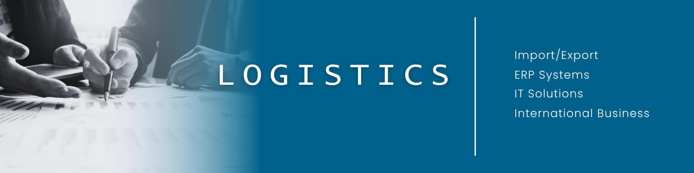

  

  <h1 align="center">👋 Hi, I'm Fernando Guevara</h1>

  <h3 align="center">ERP Solutions Architect | Cloud-Native Developer (C#, React, SQL) | Specializing in Tailored ERP Systems for SMEs</h3>
  <h4 align="center">From El Salvador 🇸🇻, based in Germany 🇩🇪</h4>

## 🚀 About Me

I'm a versatile professional with over 25 years of experience in logistics, operations management, and software development. I specialize in helping small and medium-sized enterprises (SMEs) modernize their technology infrastructure through:

- ☁️ **Cloud Solutions**: Cloud-native applications, serverless architecture, and cloud migration
- 💻 **Full-Stack Development**: C#, JavaScript, React
- 📊 **Data Analysis**: Business insights, trend analysis, data visualization
- 🏭 **ERP Systems**: Custom development, inventory management, order processing
- 🌐 **Web Development**: Front-end development, API integration, website optimization

## 🌟 Services for SMEs

- **Cloud Migration**: Seamless transition to cloud infrastructure
- **Serverless Solutions**: Cost-effective, scalable applications
- **Modern Web Applications**: Responsive, secure, and performant
- **Digital Transformation**: End-to-end business process optimization
- **Custom ERP Solutions**: Tailored to your business needs

## 🌍 Industry Experience

- 🏥 Medical Technology
- 👕 Manufacturing
- 🏭 Industrial Engineering
- 🏢 Real Estate
- 📞 Customer Service
- 🏦 Insurance

## 🛠️ Technical Skills

- **Cloud & DevOps**: Serverless Architecture, Docker
- **Programming**: C#, JavaScript, React
- **Tools**: GitHub, Netlify, Visual Studio, Docker
- **Web Development**: Front-end development, API integration
- **Data Analysis**: Data visualization, business insights
- **ERP Systems**: Production orders, inventory management
- **System Integration**: Marketing automation, SEO optimization, analytics integration

## 🗣️ Languages

- 🇪🇸 Spanish – Native
- 🇬🇧 English – Fluent
- 🇩🇪 German – A2 (Basic)
- 🇮🇹 Italian – Conversational

## 🌐 Connect with me:

-  [LinkedIn](https://linkedin.com/in/fernandoguevara-logistics)
-  [Portfolio](https://fernandoguevara.netlify.app)
-  [Email Me](mailto:fernandoguevara.sv@gmail.com)

